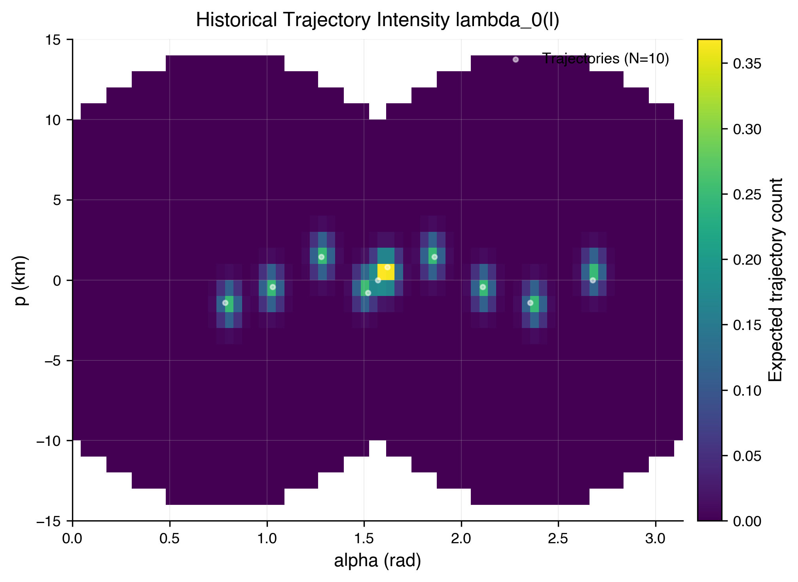
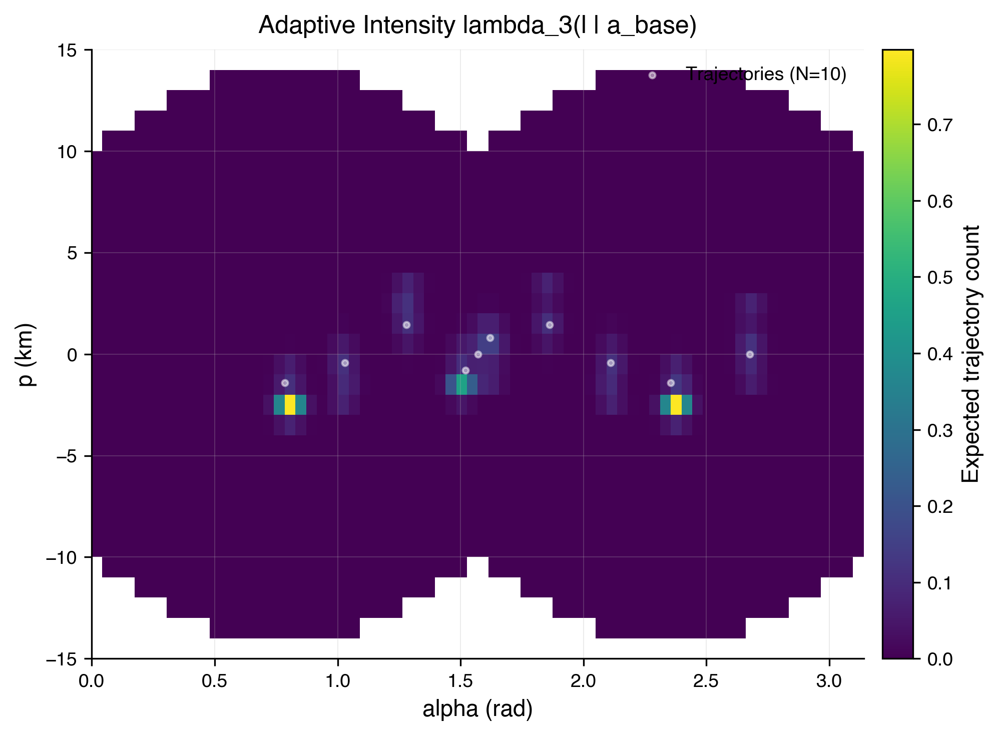
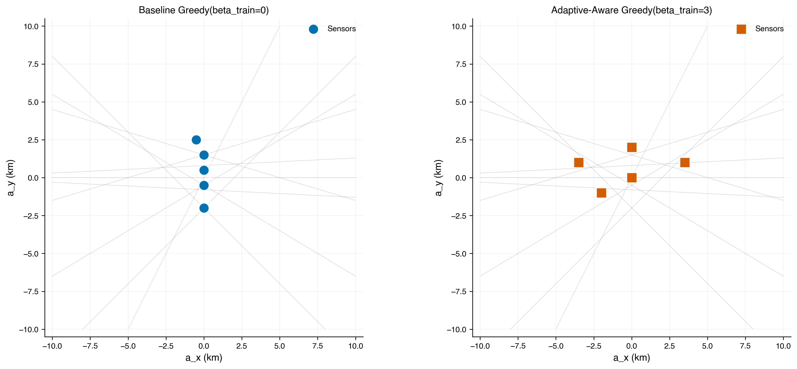
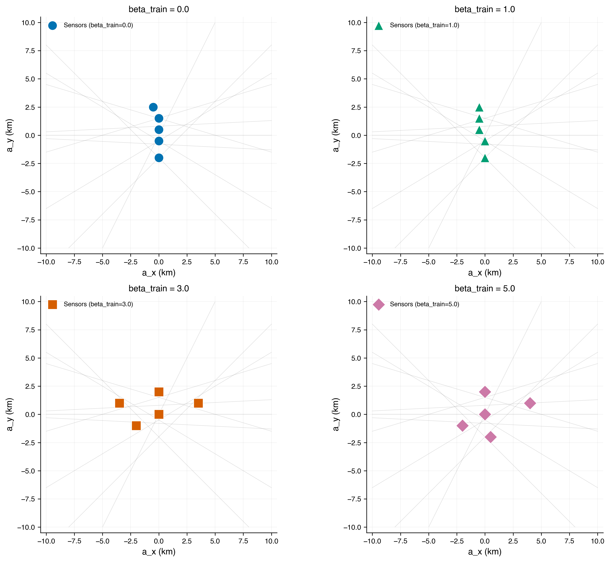
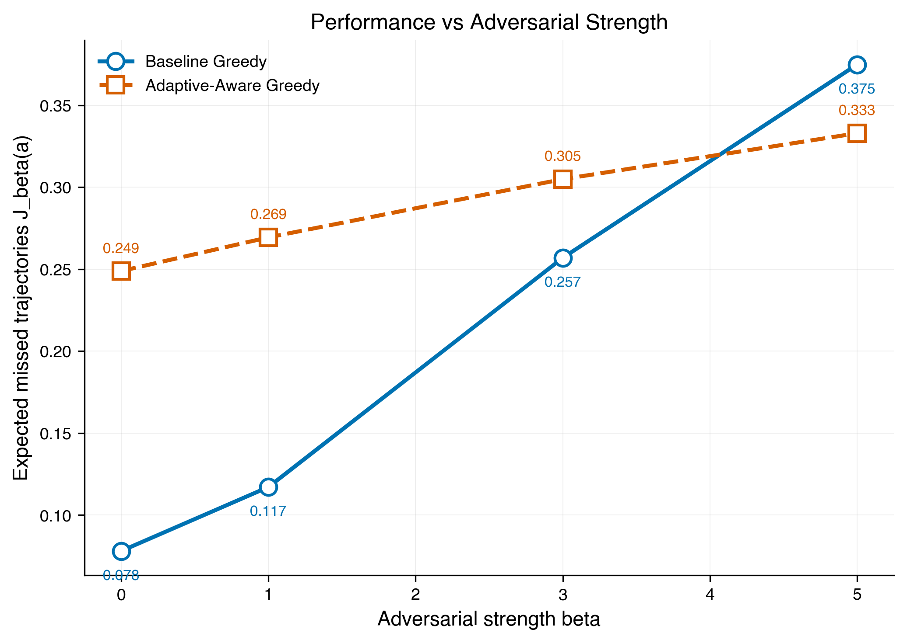

# Sensor-Aware Adaptive Linear Trajectory Model

This project explores sensor placement strategies for barrier coverage systems where targets move along linear trajectories. The research addresses a fundamental tension in surveillance: sensors placed optimally against historical traffic patterns may fail when targets adaptively route around detection zones.

## The Problem

In barrier coverage, sensors form a detection barrier across a region to detect targets crossing from one side to another. Traditional approaches optimize sensor placement based on historical trajectory data, but this creates a predictable pattern that sophisticated targets can learn to circumvent.

This project implements and compares two sensor placement strategies:

1. **Baseline Greedy Placement** — Sensors are positioned using only historical trajectory intensity, assuming targets follow established patterns.

2. **Adaptive-Aware Greedy Placement** — Sensors are positioned while accounting for the possibility that targets will shift toward low-detection trajectories after observing the sensor configuration.

The adversarial strength parameter `beta` controls how strongly targets adapt their routes. Higher values represent more sophisticated adversaries who better exploit gaps in sensor coverage.

## How It Works

### Trajectory Representation

Trajectories are represented in a normalized coordinate system `(alpha, p)` where:
- `alpha` is the angle of the trajectory normal (direction perpendicular to movement)
- `p` is the perpendicular distance from the origin to the trajectory line

This representation maps each linear trajectory to a single point, enabling density estimation over the space of all possible paths.

### Historical Intensity Model

The baseline intensity function `lambda_0(l)` represents where trajectories historically pass through the region. It is estimated from observed data using a histogram with Gaussian smoothing.



The heatmap shows the distribution of historical trajectories in `(alpha, p)` space. Brighter regions indicate higher historical traffic density.

### Sensor Detection Model

Each sensor provides probabilistic coverage based on proximity in trajectory space. The detection probability `gamma_C(l, sensor)` decreases with distance from the sensor's optimal detection line, modeled with a Gaussian falloff.

The overall detection probability across multiple sensors is:
```
pi_C(l) = prod_i (1 - gamma_C(l, sensor_i))
```

### Adaptive Intensity Under Adversarial Targets

When targets can adapt, they shift their routes toward regions where sensor coverage is weak. The adaptive intensity function captures this:
```
lambda_beta(l | sensors) proportional to lambda_0(l) * exp(beta * pi_C(l))
```

The parameter `beta` controls the strength of adaptation. As `beta` increases, trajectory density concentrates in low-detection regions.



The adaptive intensity shifts mass away from regions with high sensor coverage (showing the baseline sensor positions), concentrating probability in gaps.

## Sensor Placement Comparison

The two placement strategies yield different sensor configurations:



**Left:** Baseline Greedy places sensors based on historical traffic density, covering the most common trajectory routes.

**Right:** Adaptive-Aware Greedy spreads sensors more broadly, anticipating that targets will avoid densely covered regions.

### Placement Across Adversarial Strengths

Sensor configurations for different training assumptions about adversarial strength:



As `beta_train` increases, the placement algorithm distributes sensors more evenly across the region, trading off peak coverage of historical routes for robustness against adaptive targets.

## Performance Evaluation

The key metrics are:
- **Expected Missed Trajectories J_beta** — The expected number of trajectories that avoid detection, integrated over the intensity distribution
- **Void Probability nu_beta** — The probability that no trajectories cross the barrier undetected

### Performance vs Adversarial Strength



At low adversarial strength (`beta=0`), the baseline approach performs well since targets do not adapt. However, as `beta` increases, the Adaptive-Aware strategy maintains better detection rates while baseline performance degrades.

| Method | beta=0 | beta=1 | beta=3 | beta=5 |
|--------|--------|--------|--------|--------|
| Baseline Greedy | 0.045 | 0.163 | 0.415 | 0.553 |
| Adaptive-Aware Greedy | 0.081 | 0.159 | 0.270 | 0.347 |

The Adaptive-Aware approach sacrifices some performance against non-adaptive targets (higher J at beta=0) but provides substantially better robustness as adversarial strength increases.

## Running the Simulation

Install dependencies:
```
pip install -r requirements.txt
```

Open the notebook:
```
jupyter notebook sensor_aware_model.ipynb
```

Or run headlessly:
```
jupyter nbconvert --to script sensor_aware_model.ipynb
python sensor_aware_model.py
```

## Key Findings

1. **Adaptation asymmetry** — Sensors designed for historical patterns are more vulnerable to adaptation than sensors designed for moderate adaptation, even when targets are non-adaptive.

2. **Robustness vs optimality** — There is a trade-off between peak performance against known patterns and graceful degradation under uncertainty.

3. **Sensor distribution matters** — When anticipating adaptation, spreading sensors more uniformly across the region provides better coverage of the adapted trajectory distribution.

## Citation

```
@misc{kim2025nearoptimalsensorplacementdetecting,
  title={Near-optimal Sensor Placement for Detecting Stochastic Target Trajectories in Barrier Coverage Systems},
  author={Mingyu Kim and Daniel J. Stilwell and Harun Yetkin and Jorge Jimenez},
  year={2025},
  eprint={2505.00825},
  archivePrefix={arXiv},
  primaryClass={cs.RO},
  url={https://arxiv.org/abs/2505.00825}
}
```
